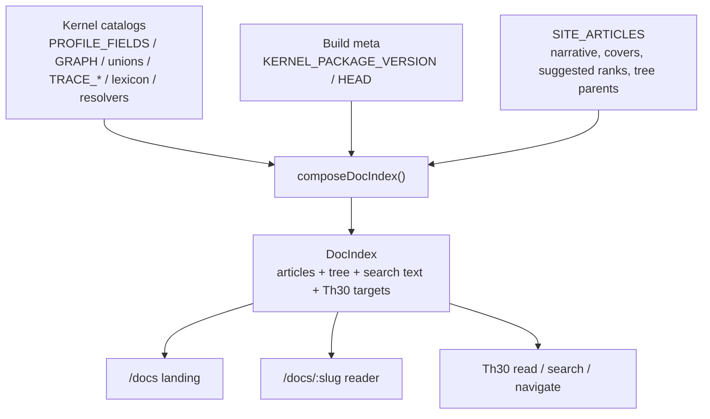

# Site docs spec

Working spec for `/docs` on `feat/docs`. The UI and Th30 project one composed index; kernel catalogs are imported, not copied.

This file is the locked data model + information hierarchy. Implementation starts from here.

# Docs data model (schema first)

The UI, the landing cards, the reader tree, and Th30 all consume **one composed index**. Nothing in that index copies `FieldMeta.doc`, facet lists, stop kinds, or version strings. Those are imported from `@theoremai/agents/schema` (and build-time kernel meta) at compose time.

This matches how the playground already works: [inspector.tsx](app/components/inspector.tsx) and [profile-editor.tsx](app/components/profile-editor.tsx) project `fieldMeta` / `PROFILE_GRAPH`. [unified-docs.ts](app/lib/docs/unified-docs.ts) is the anti-pattern — hand-authored, still on `@1.0.0` and the deleted `model.config` shape, and it is the only thing Th30 can read.

`/docs` is a SideNav href in [shell.tsx](app/routes/shell.tsx) with **no route** in [routes.ts](app/routes.ts). Schema lands before chrome.



## What I reviewed

**Kernel** (`../theoremai`, `@theoremai/agents` 2.0.1): truth is already importable TypeScript. `schema.ts` says host UIs and docs import it so hover tips stay in lockstep. Three doc surfaces, deliberately not mixed:

- Published: `README.md` only
- Machine catalogs in `src/` (these ship): `PROFILE_FIELDS` + `fieldMeta`, `PROFILE_GRAPH`, closed unions, `TRACE_*`, `LEXICON_KEYS`, omit resolvers
- Repo contracts in `docs/contracts/` — **do not ship**, gated by `docs-truth`. Public `/docs` will not show them.

**Frontend README**: site is a projection of THEOREM; schema vocab is client-safe; kernel runtime is server-only. The README itself is already stale (`model.config.*.builtInTools`).

**Th30**: [th30.ts](app/lib/.server/th30.ts) tools `read` / `searchDocs` / `navigate` are closed over `unified-docs` and dead home hashes (`/#pillars`). The rail button is disabled. Marks (`BootMark`, `NavMark`) are loaders, not Th30.

**Astryx Card**: `@astryxdesign/core` `Card` is a surface (padding, elevation, variant). Images are children (`Thumbnail` / `img` / `AspectRatio`). Suggested reads should be `ClickableCard` + media child, not a Card `src` prop.

## Ownership (locked)

- **Kernel keeps owning** catalogs, omit resolvers, export names, lexicon. Do not add an article CMS to `@theoremai/agents`. Do not put site copy in the kernel.
- **Frontend owns** `DocArticle` / `AuthoredBlock` / `ResolvedBlock` types, authored guides, landing IA, covers, Th30 prompts.
- Types are written so they can move into the kernel later without a rewrite (closed unions, derived ids, no `FacetKind` aliases).
- **Public surface** = generated catalog articles + authored guides + published README truths (install, export table). Maintainer contracts stay on GitHub.

## Information hierarchy (pages, not a URL per leaf)

Leaves are **sections on a chapter page**, not their own routes. The sidenav is chapters → in-page headings. Cards may deep-link `#session` or later use a focused slug — both are allowed; we do not pre-decide the click story.

Interface / React / playground are peer chapters. They will be published — omit install facts until they ship.

`PROFILE_TYPES` is a **required** section on Profiles. If `optionDescriptions` are missing, that is a kernel change we make — compose throws until they exist. Do not hide the section.

```text
/docs                         landing: search + carousel
│
├── start                     PAGE
│     #install
│     #first-turn
│     #first-session
│
├── runner                    PAGE     doors
│     #turn                   runTurn
│     #session                runSession + try; pins live under profiles#types#live
│     #decision               runDecision
│
├── profiles                  PAGE
│     #types                  all six PROFILE_TYPES (required)
│       #text                 member doc; no text.* facet
│       #image                image.* pins
│       #speech               speech.* pins
│       #live                 live.* pins (once)
│       #decision             decision facet
│       #host                 no model; invokeTool ceiling
│     #identity               shared anatomy — not a type name
│     #models
│     #inputs
│     #outputs
│     #turn-behaviour
│
├── tools                     PAGE
│     #register               EXTRA_FIELDS, loadTier
│     #allow
│     #builtins
│
├── guardrails                PAGE
│     #inbound
│     #egress
│     #lexicon
│
├── observability             PAGE
│     #traces
│     #sinks
│
├── providers                 PAGE
│     #pairs
│     #google
│     #openrouter
│     #local
│
├── interface                 PAGE     headless — no install fact yet
│     #from-profile
│     #runners
│
├── ui                        PAGE     @theoremai/react — no install fact yet
│     #chat
│     #live
│
├── playground                PAGE
│     #draft
│     #compile
│
├── host                      PAGE
└── cli                       PAGE
```

Twelve chapter URLs. Generated catalog rows compose **into** those pages as sections (`FACET_SECTION` / `UNION_SECTION` name the heading, not a new slug). Optional later: a focused guide slug that is the same article with a different `canonicalPath` — not a second catalog.

`profiles#types` is not optional. Kernel work: add `optionDescriptions` (or TRACE-style `{label,doc}`) for every `PROFILE_TYPES` member — text, image, speech, live, decision, host. Type-scoped pin facets (`image`, `speech`, `live`, `decision`) nest **under** `#types`, not beside it. There is no `text.*` facet; `#text` is the member doc only. `live.*` pins render once, under `#types #live`. `runner#session` is the door (runSession, T0, try), not a duplicate pin table.

## Authored vs generated

Hand-maintain only what catalogs cannot know:

- Landing suggested-read picks (ranks 1–4), covers, ledes, “why Theorem”
- Tutorial / concept narrative and media
- Tree grouping labels and parent ids
- Playground embed seeds (host policy, not kernel truth)

Generate, never type twice — **as sections on chapter pages**, not as extra URLs:

- Each `PROFILE_GRAPH` facet’s fields → a heading on the chapter `FACET_SECTION` names
- Each worthy union → a heading on `UNION_SECTION` (PROFILE_TYPES → `profiles#types`, required)
- Trace / lexicon → headings on observability / guardrails
- Version / “last updated” from kernel git + [kernel-meta.mjs](scripts/kernel-meta.mjs) — **throw** on the `'1.0.0'` / empty-HEAD fallback; append `+dirty` on porcelain
- Omit shown only as `fieldMeta.unset` “(default)” — not a parallel resolver UI. Kernel ask: presence rows for canary/sanitize/redact, streaming mode, continue defaults, observability omit (see review 2). No generated export-inventory page (README already gated).

Playground excludes `host` and `decision`. Generated reference **includes** them. Authored playground guides must not imply the composer authors all six types.

## Schema sketch

New module: [app/lib/docs/schema.ts](app/lib/docs/schema.ts) (types + closed unions only). Compose lives beside it; authored instances in [app/lib/docs/articles/](app/lib/docs/articles/).

```ts
export const DOC_KINDS = ['guide', 'reference', 'tutorial', 'concept'] as const;
export type DocKind = (typeof DOC_KINDS)[number];

/** Section ids = the IA tree below, not PROFILE_GRAPH. */
export const DOC_SECTIONS = [
  'start', 'runner', 'profiles', 'tools', 'guardrails',
  'observability', 'providers', 'interface', 'ui', 'playground',
  'host', 'cli',
] as const;
export type DocSection = (typeof DOC_SECTIONS)[number];

export type DocMediaRef = {
  src: string;
  alt: string;
  kind: 'image' | 'video';
  caption?: string;
};

/** Lookups the kernel can actually answer. No fieldPresence (already on fieldMeta.unset). No door list. */
export type DocFact =
  | { id: string; label: string; from: 'field'; path: string; show: 'unset' | 'required' | 'type' | 'profileTypes' }
  | { id: string; label: string; from: 'union'; union: ArrayUnionName; member: string }
  | { id: string; label: string; from: 'pairs'; table: 'PROFILE_TYPE_PROTOCOLS' | 'PROTOCOL_PROVIDERS'; key: string };

export type DocAction =
  | { kind: 'playground'; seed: PlaygroundSeedId }
  | { kind: 'copy'; blockId: string }
  | { kind: 'open'; slug: string };

/** Authored overlay only. Generated articles never use this type. */
export type DocArticleDef = {
  id: string;          // stable, not the URL
  slug: string;        // /docs/:slug — also /docs/:slug.md
  title: string;
  topic: DocSection;   // header chip + tree section
  kind: Exclude<DocKind, 'reference'>; // reference is generated
  summary: string;     // 110–160 chars, why/when only; compose throws if it equals the lede
  cover?: DocMediaRef;
  suggest?: { rank: 1 | 2 | 3 | 4; blockId?: string };
  tree: { parent?: string; order: number };
  /** Absorbs any generated article so one URL owns the topic. */
  replaces?:
    | { kind: 'catalog.facet'; id: ProfileGraphFacetId }
    | { kind: 'catalog.union'; union: DocUnionName }
    | { kind: 'catalog.trace'; group?: string }
    | { kind: 'catalog.lexicon' };
  related?: readonly string[]; // compose: must exist in the index
  actions?: readonly DocAction[];
  faq?: readonly { question: string; answer: string }[]; // max 5; no auto-FAQ
  blocks: readonly AuthoredBlock[];
  // lastUpdated, ttr, version — forbidden here
};

export type AuthoredBlock =
  | { id: string; kind: 'lede'; text: string }
  | { id: string; kind: 'prose'; text: string }
  | { id: string; kind: 'media'; media: DocMediaRef }
  | { id: string; kind: 'code'; source: CodeSource }
  | { id: string; kind: 'callout'; tone: 'note' | 'warn'; text: string }
  | { id: string; kind: 'facts'; items: readonly DocFact[] }
  | { id: string; kind: 'catalog.fields'; paths: readonly string[] | { prefix: string } }
  | { id: string; kind: 'catalog.union'; union: DocWorthyUnion }
  | { id: string; kind: 'catalog.trace'; group?: string }
  | { id: string; kind: 'catalog.lexicon'; keys?: readonly string[] }
  | { id: string; kind: 'embed.playground'; seed: PlaygroundSeedId };

export type DocBlockKind = AuthoredBlock['kind'];

/** Snippets come from the playground compiler (omit-stripping) or a hashed README heading. */
export type CodeSource =
  | { from: 'seed'; seed: PlaygroundSeedId }
  | { from: 'readme'; heading: string; nth: number; sha256: string };

/**
 * After compose. The reader and Th30 switch on this only — never on catalog.fields prefixes.
 * Compose expands field/union/trace/omit into rows using fieldMeta.
 */
export type ResolvedBlock =
  | Extract<AuthoredBlock, { kind: 'lede' | 'prose' | 'media' | 'callout' }>
  | { id: string; kind: 'facts'; items: readonly { id: string; label: string; value: string }[] }
  | { id: string; kind: 'fields'; rows: readonly { path: string; meta: FieldMeta }[] }
  | { id: string; kind: 'union'; name: DocWorthyUnion; members: readonly { value: string; doc: string }[] }
  | { id: string; kind: 'trace'; rows: readonly { key: string; label: string; doc: string }[] }
  | { id: string; kind: 'lexicon'; rows: readonly { key: string; defaultText: string }[] }
  | { id: string; kind: 'code'; lang: 'ts'; code: string; source: CodeSource }
  | { id: string; kind: 'embed.playground'; seed: PlaygroundSeedId };

/** Resolved article both UI and Th30 read. */
export type DocArticle = {
  id: string;
  slug: string;
  title: string;
  topic: DocSection;
  kind: DocKind;
  summary: string;
  cover?: DocMediaRef;
  suggest?: { rank: 1 | 2 | 3 | 4; blockId?: string };
  tree: { parent?: string; order: number };
  related: readonly string[];
  actions: readonly DocAction[];
  origin: 'authored' | 'catalog';
  canonicalPath: string;       // /docs/live — fragments via articleFragment(article, blockId)
  truth: {
    kernelVersion: string;
    kernelHead: string;
    catalogHash?: string;
  };
  ttrMinutes: number;          // computed
  updatedLabel: string;        // e.g. "kernel 2.0.1+dirty" — never a hand date
  blocks: readonly ResolvedBlock[];
};

export type DocIndex = {
  articles: readonly DocArticle[];
  tree: readonly DocTreeNode[]; // section nodes = DOC_SECTIONS; children = articles
  suggested: readonly { slug: string; blockId?: string; rank: 1 | 2 | 3 | 4 }[];
  bySlug: Readonly<Record<string, DocArticle>>;
  redirects: readonly { from: string; to: string; reason?: string }[];
};
```

`ArrayUnionName` is derived by shape from `@theoremai/agents/schema` exports that are readonly string arrays (not a 30-name hand object). `DOC_WORTHY_UNIONS` is the editorial page allowlist (`satisfies readonly ArrayUnionName[]`) and **compose throws if a worthy union has no member docs** in `optionDescriptions` or a TRACE-style `{label,doc}` record. `MEDIA_INPUT_KIND_VALUES` is the union; `MEDIA_INPUT_KINDS` is a MIME map — do not page the map. `FACET_SECTION` is `Record<ProfileGraphFacetId, { page: DocSection; heading: readonly string[] }>` (total). Type-scoped facets: `{ page: 'profiles', heading: ['types', 'image'] }` etc. Shared anatomy: `{ page: 'profiles', heading: ['identity'] }`. `UNION_SECTION` is the same shape (`PROFILE_TYPES` → `{ page: 'profiles', heading: ['types'] }`). No `DOC_DOORS`. No frontend `DEPRECATED_UNION_MEMBERS`.

Ids: **one article per chapter** (`DOC_SECTIONS`). Facets, unions, extra fields, traces, lexicon are **heading ids** on that page (`#types`, `#session`, `#loadTier`), not `ref:` URLs. Authored block ids `^[a-z][a-z0-9-]*$`. Suggested cards are `{ slug, blockId?, rank }` so a card can open `/docs/runner#session` without a second page.

Facet field ownership (compose throws on 0 or >1 owners): most specific `profilePath` prefix wins; `ownsFields` adds (except `decision.ownsFields: ['inputs']` is a cross-link).

`composeDocIndex()` is a **Vite plugin** (`docsIndexPlugin`) using a Node module runner (full TS transform — strip-only Node cannot load `@theoremai/agents` or `./kernel` because of `constructor(private readonly …)` in `turn-trace.ts`). Expose `virtual:docs/index` to **`.server` only**. `generateBundle` `emitFile`: `docs/index.json`, `docs/*.md`, `llms.txt`, `sitemap.xml`. Do not commit generated files; do not write `public/` in the plugin. Dev: recompose when `app/lib/docs/articles/**` changes.

1. Start from twelve chapter articles (`SITE_ARTICLES` + empty generated shells)
2. Inject facet / union / extra-field / trace / lexicon rows as **sections** via `FACET_SECTION` / `UNION_SECTION`
3. Resolve every authored block → `ResolvedBlock` (reader never calls `fieldMeta`)
4. Throw on bad paths, pair keys, related, seeds, copy targets, duplicate DOM ids, missing member docs, kernel-meta fallback
5. Tree from topics; search text from resolved rows; TTR from resolved text
6. `lastmod` / `dateModified` = `git log -1 --format=%cI` over that article’s source files (authored file, or `schema.ts` + presence/graph/observability as relevant). **Never mtime.** Omit `lastmod` if git cannot answer.

Th30 `NAVIGABLE_PATHS`, `read`, and `search` become functions over `DocIndex`. Delete [unified-docs.ts](app/lib/docs/unified-docs.ts).

Every block has a stable `id`. Field rows use the dotted path as the **URL** fragment (`#live.vad`). Th30 highlight uses `document.getElementById` / `CSS.escape` — `querySelector('#live.vad')` means id `live` + class `vad`. Compose throws on duplicate ids in one article.

## Worked example: `/docs/runner` (`#session` is the live section)

Pressure-test page: [Gemini 3.1 Flash live preview](https://ai.google.dev/gemini-api/docs/models/gemini-3.1-flash-live-preview). That URL is a model card — spec table, a migrate-away note, then “visit the Live API guide.” The facts people (and agents) want are split across three documents. We refuse that split.

### Authored overlay (what a human writes)

Only the frame. Pins, omit meanings, legal protocol pairs, voice vocabulary stay in the kernel.

```ts
{
  id: 'runner',
  slug: 'runner',
  title: 'Runner',
  topic: 'runner',
  kind: 'guide',
  summary: 'Three doors: a turn, a live session, or a host-side decision.',
  cover: { src: '/docs/covers/runner.webp', alt: 'Runner', kind: 'image' },
  suggest: { rank: 1, blockId: 'session' }, // card → /docs/runner#session
  tree: { order: 20 },
  related: ['profiles'], // profiles#types is a heading, not a URL
  actions: [
    { kind: 'playground', seed: 'liveVoice' },
    { kind: 'copy', blockId: 'minimal' },
  ],
  blocks: [
    { id: 'lede', kind: 'lede', text: 'The kernel runs one of three doors. Pick the door; the profile type follows.' },
    { id: 'turn', kind: 'prose', text: 'runTurn is one request, one stream, then done or continue.' },
    { id: 'session', kind: 'lede', text: 'A live profile is not a turn with audio bolted on. It is a long-lived session.' },
    {
      id: 'facts',
      kind: 'facts',
      items: [
        { id: 'type', label: 'Profile type', from: 'union', union: 'PROFILE_TYPES', member: 'live' },
        { id: 'protocol', label: 'Protocol', from: 'pairs', table: 'PROFILE_TYPE_PROTOCOLS', key: 'live' },
        { id: 'provider', label: 'Provider', from: 'pairs', table: 'PROTOCOL_PROVIDERS', key: 'geminiLive' },
        { id: 'ingress-audio', label: 'Ingress audio', from: 'field', path: 'live.ingress.audio', show: 'unset' },
        { id: 'ingress-video', label: 'Ingress video', from: 'field', path: 'live.ingress.video', show: 'unset' },
        { id: 'ingress-text', label: 'Ingress text', from: 'field', path: 'live.ingress.text', show: 'unset' },
      ],
    },
    { id: 'pins', kind: 'catalog.fields', paths: { prefix: 'live.' } },
    { id: 't0', kind: 'catalog.fields', paths: ['tools.allow', 'loadTier'] },
    { id: 'minimal', kind: 'code', source: { from: 'seed', seed: 'liveVoice' } },
    { id: 'try', kind: 'embed.playground', seed: 'liveVoice' },
  ],
}
```

`replaces` kills the generated `/docs/reference/live` dump so there is one URL, one job. Unions that never earn a guide (e.g. `CACHE_TTLS`) stay generated-only.

### What compose resolves (the page)

Header: **Runner** · chapter · ~8 min · `kernel 2.0.1`. Sidenav: Start, Runner, Profiles, … and on this page Turn / Session / Decision.

Then, in one scroll:

- Lede (authored)
- Spec strip: type `live`, protocol `geminiLive`, provider `google`, ingress unset On/On/Off — each from `fieldMeta` or pair tables. **No relay URL** (unauthenticated, spends free Gemini keys; not a docs fact)
- Pin table from resolved `live.*` rows. Fragment `#live.vad` as a URL hash; highlight uses `getElementById` / `CSS.escape`, never `querySelector('#live.vad')`
- `tools.allow` + `loadTier` rows — T0/session-setup lives there (`EXTRA_FIELDS` page exists so `loadTier` has an owner)
- Snippet from `compilePlayground(DOCS_SEEDS.liveVoice)` — same omit-strip path as the playground. Do **not** cite the README live block (it materializes `canary: true` and `ingress.audio: true`)
- Related: `/docs/profiles` (types heading is `#types` on that page)

That is the opposite of Google’s card. Their page says “legacy, go elsewhere, here is a capability matrix.” Ours has to finish the job: what it is, the facts you will copy, the pins, the trap, a snippet, a try.

### Versus that Google URL

Steal:

- One H1, one copyable id
- A spec strip before prose
- Honest status (their “legacy preview” / our kernel pin)
- Related links that are real pages, not “see guide”

Reject:

- Stub that defers to another URL
- Capability wall of Supported / Not supported as the body
- Two dates (“March 2026” vs “Last updated 2026-09-15”)
- No try-it, no snippet on the card
- No fragment per fact (you cannot cite “function calling: supported” as a stable hash)
- Agents can scrape; they cannot act

Visual bar is not Google-docs chrome. Spec strip + catalog rows should feel like an instrument (playground inspector language), not a markdown table in a wiki. Cards on the landing are cinematic; the reader is precise.

## AEO / SEO / agents

The composed index is the SEO object. HTML is one projection. If we write pages and then “add SEO later,” we will invent a second catalog.

**Answer engine (AEO).** Authored `summary` is 110–160 characters, why/when only (compose throws if it equals the lede). Generated summaries: `` `${label} — ${fieldMeta(path).doc} Applies to ${types}.` `` — throw if the text still says `Model id is on model` (kernel drift). Do not append extra fact labels. That string is meta / OG / `llms.txt`. JSON-LD is `TechArticle` + `mainEntity: DefinedTermSet` of `{ name: path, description: doc, url: #fragment }` — **not** `PropertyValue` (that type is not valid on TechArticle). Curated `faq[]` may render on the page; do not claim FAQ rich results (Google limited those in 2023). `llms.txt` is generated and cheap; it does not drive the schema.

**Classic SEO.** SSR from the prebuilt index (`.server` import of `virtual:docs/index`). Canonical `/docs/:slug`. Title `{title} · Theorem docs`. Sitemap emitted by the plugin; `lastmod` from `git log -1 --format=%cI` on source paths, or omit. `.md` twins: `noindex` + `Link` canonical to the HTML; HTML gets `rel=alternate` markdown. Cover → OG. One H1. No client-only body.

**Machine twins (same projector as Th30).**

- `/docs/:slug` — HTML reader
- `/docs/:slug.md` — `projectArticleText` (title, summary, facts, field docs, code). This is what Cursor / Claude / wget should fetch
- `/docs/index.json` — the `DocIndex` (plain `Record`, no Map)
- `/llms.txt` — generated list of those markdown URLs + summaries
- JSON-LD: `TechArticle` + `DefinedTermSet` (not PropertyValue). `dateModified` from git commit ISO of source files. Optional visible FAQ, no rich-result claim. `SoftwareSourceCode` only for resolved seed snippets.

One projector. If HTML and `.md` disagree, that is a bug, same class as `unified-docs` drift.

**Agents taking action.** Read is not enough. The index already has `actions` and Th30 tools. Wire them to the same ids:

- `read` → article or `#fragment` via `projectArticleText` (line-numbered if we still want that)
- `search` → bag-of-words over title, summary, fact labels, `FieldMeta.doc` (not a parallel tag list). A chapter-name query returns the chapter card. An inner match returns that heading or field as its own hit (`title` / `excerpt` from the fragment, `href` `/docs/:slug#blockId`). Child `live.*` rows collapse under `#live` unless the query names the child.
- `navigate` → free-text `slug` + optional `blockId`, validated against `bySlug` (not a 60-member `z.enum`)
- `highlight` → `getElementById` / `CSS.escape` (never raw `#live.vad` as a selector)
- `actions.playground` → open seed (human click or Th30)

Publish `/docs/index.json` as the well-known map a third-party agent uses without calling Th30. Do not invent a second OpenAPI that restates slugs.

**What we will not do for AEO.** Keyword-stuffed prose. A blog date next to a kernel pin. Fetching GitHub contracts so crawlers index maintainer specs. A hand-maintained `llms.txt`.

## Staleness and failure states

The thing that already failed: a parallel prose catalog. Rules that prevent the next one:

- **Compose-time throw** if a `catalog.fields` path fails `fieldMeta()`, a facet id is unknown, a suggest rank repeats, or slugs collide. No silent omit in prod for selector misses — a missing field is a broken docs build.
- **Compose is the gate.** `npm run lint:docs` runs `docs:compose` (the Vite plugin runs the same compose) then Biome-checks importable TypeScript fences extracted from authored markdown. `npm run build` fails if compose throws. Do not invent a sibling CI.
- **No GitHub fetch** at request time. Sibling checkout is the pin. `updatedLabel` from kernel-meta — **throw** if version is the `'1.0.0'` fallback or HEAD is empty; append `+dirty` when `git status --porcelain` is non-empty.
- **Dev vs published**: local `/docs` describes the sibling kernel, which may be ahead of npm. Show the pin in the reader header so that is honest.
- **Stages / “target” APIs**: generated from live catalogs (fine). Authored prose must not say “shipped” unless the published README does.
- **Unknown slug**: docs-aware 404 with search over the same index — not the generic root boundary.
- **Missing cover**: cards still render; image is optional.
- **Th30 vs UI drift**: one text projector over blocks (`projectArticleText(article)`) used by Th30 `read` and by search indexing. Do not keep a summarized parallel body.
- **Forward-compat**: new `DocBlockKind` is a closed-union change. An unknown kind fails typecheck; do not add an “any html” escape.
- **Assets**: suggested covers must exist under `public/`. `/hero/valley.*` **does** exist (review 2 correction). Broken suggested-cover `src` fails compose.
- **Do not** paste `FieldMeta.doc` into `prose`. No token-overlap lint as a gate (it scores generic words, not restatement).
- **Do not** publish `/api/live/relay` as a docs fact. The relay is unauthenticated and spends free Gemini keys.
- **Do not** seed example `code` blocks with materialized omit defaults (`canary: true`, `allowContinue: [...]`, `inputs.text: true`) — same rule as the playground compiler.

## UI projection (not this PR’s job, but the schema is for this)

Landing (`/docs`): same elevated AppShell panel as the home hero, one viewport tall. Top: golden-marsh still (wide aerial, cloud band at 78%) with the kernel package version (`Text type="label"`, same `getKernelPackageVersion` as the home wordmark) above “Documentation” bottom-left (`display-1`). Stills can take a lavender exposure overlay (`STILL_MATCH` in [still-match.ts](app/lib/docs/still-match.ts)); files are not rewritten. Below: centered `TextInput` search + th30 `IconButton`, then one `Carousel`. Idle tiles are `index.suggested` (start, profiles, tools, guardrails) — cover, title, summary. A query replaces those tiles with `searchDocs` hits and scrolls horizontally. Chapter hits keep cover, chapter title, topic / TTR, summary. Inner hits keep the chapter cover and topic / TTR, but the title and excerpt are the resolving heading or field — not a second copy of the chapter card. The tile opens that `#` fragment. The copy block keeps a reserved height so search meta does not resize the header.

Reader (`/docs/:slug`): same elevated AppShell panel as home and `/docs` (not `isOnBase`). Outer `Layout` start is the playground panel chrome — `Section variant="raised"` + “Theorem Docs” heading + a supporting “Last updated: Sept 25, 2026” line from the chapter `dateModified` (newest index date on 404) + the same `Search docs` field as `/docs` (`searchDocs`, hidden label, Search placeholder, search icon). The list is Astryx `SideNavSection` + nested `SideNavItem` (chapter is the destination; headings nest). Chapter rows carry the playground tree glyph (`CHAPTER_ICON` / `FACET_ICON`); nested headings do not. The current chapter and search hits stay open. `LayoutPanel hasDivider` is the rail edge. Each chapter has a unique wide still (`isWideStill` — 1536×656 and 1536×864); that cover is the landing tile and the 20%-tall reader header (title bottom-left). The still sits in the article scroll and is not pinned. Compose throws if a cover is missing, not wide, or reused. No `updatedLabel`, no topic/TTR bar. Body is the block renderer. Astryx `Outline` is a sticky rail under the still, beside the body, over `index.tree` children — it stays after the cover scrolls away. No MDX, no CMS.

Shell: landing and reader sit in the elevated home panel; playground stays `isOnBase`.

## Implementation order after you accept this schema

1. Types + Vite `docsIndexPlugin` + `DOCS_SEEDS.liveVoice` + replace `unified-docs`. `/docs` may still 404.
2. `/docs` + `/docs/:slug` (+ `.md` twins), landing, reader, redirects.
3. Th30 client that actually navigates/highlights.

I do not need more from you to start step 1. Optional: if “top” meant something other than **topic**, say so.

## Reviews

[First pass](e556576c-b87d-4cdd-9838-38e92ab0841e): ship-with-fixes — killed the string DSL, phantom types, Maps/methods, request-time compose, thin union pages, Th30 enum balloon.

[Opus 5.5](655af92d-daee-4e36-9675-e7c8ab9d982f): **rethink the truth-access layer, keep the IA.** Strip-only Node cannot load `@theoremai/agents` or `./kernel` (`turn-trace.ts` parameter property). `DocArticle.blocks` was still unresolved (reader would need the kernel). The live example broke five of its own rules. `fieldPresence` / `door` / `readme:runSession` / `DOC_DOORS` / `DEPRECATED_UNION_MEMBERS` / token-overlap lint / mtime `lastmod` / PropertyValue JSON-LD / advertising the live relay are rejected. `catalog.omit` is deleted; omit is `fieldMeta.unset` only.

### Kernel asks (frontend will not invent these)

- Presence rows (and a test vs resolvers) for canary / sanitize / redact, `outputs.streaming.mode`, continue defaults, observability omit
- **Required now:** `optionDescriptions` (or `{label,doc}`) for every `PROFILE_TYPES` member — `profiles#types` cannot ship without them. Same for any union we nest as a heading (`TURN_STAGES`, `TURN_STOP_KINDS`, …)
- Re-export `DEFAULT_ALLOW_CONTINUE` / `liveIngressChannelDefault` from `./schema` **or** drop parameter properties so strip-only Node works (Vite plugin is the frontend workaround either way)
- Fix stale `fieldMeta('image'|'speech').doc` (“Model id is on model”) and `fieldMeta('decision').doc` (“Jev profile”)
- Exhaustive facet field ownership on `PROFILE_GRAPH` (or accept the frontend prefix rule)
- README live snippet currently materializes omit defaults — do not cite it until the kernel fixes it
- Optional: `DEPRECATED_TURN_STOP_KINDS` export so deprecation is not a frontend list

### Acceptable handwritten lists

`DOC_KINDS`, `DOC_SECTIONS`, `DOC_WORTHY_UNIONS`, `FACET_SECTION`, `UNION_SECTION`, `SITE_ARTICLES` / redirects, `DOCS_SEEDS`. Everything else is derived or a kernel ask.

### Still true

Compose-from-catalog, kill `unified-docs`, no public contracts, no authored dates/versions, one projector, omit as “(default)”.
