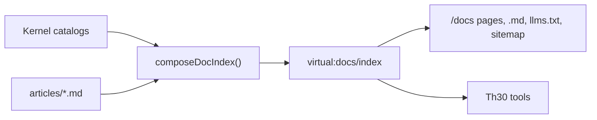

# Site docs spec

How `/docs` is built. What may go on a page is [DOCS_CONTRACT.md](DOCS_CONTRACT.md). Types live in [schema.ts](../app/lib/docs/schema.ts).

The landing page, the reader, the `.md` twins, `llms.txt`, the sitemap and Th30 all read **one composed index**. Nothing in it copies kernel copy (`FieldMeta.doc`, option descriptions, trace and lexicon text): compose imports it from `@theoremjs/agents` at build time, so a kernel change reaches every page on the next build.


```mermaid
flowchart LR
  kernel["Kernel catalogs"] --> compose["composeDocIndex()"]
  authored["articles/*.md"] --> compose
  compose --> index["virtual:docs/index"]
  index --> pages["/docs pages, .md, llms.txt, sitemap"]
  index --> th30["Th30 tools"]
```

## Where things live

| To change | Edit |
| --- | --- |
| A chapter's words, code, cover, date | its own Markdown file in [articles/](../app/lib/docs/articles/), e.g. `articles/tools.md` |
| Chapter order, or add a chapter | `DOC_SECTIONS` in [schema.ts](../app/lib/docs/schema.ts), then `articles/<section>.md` |
| Which chapter lists a facet's fields or a union's members | [placement.ts](../app/lib/docs/placement.ts) |
| Getting started's full program | the `firstTurn` draft in [seeds.ts](../app/lib/docs/seeds.ts) |
| A retired URL | `SITE_REDIRECTS` in [chapters.ts](../app/lib/docs/articles/chapters.ts) |
| The landing backdrop | `LANDING_STILL` in chapters.ts |

## A chapter file

A chapter is one Markdown file. Astryx `Markdown` renders it, and compose, search and the checks read it with the same parser ([chapter-markdown.ts](../app/lib/docs/chapter-markdown.ts)).

The front matter is one `key: value` per line. All but `suggest` are required.

| Key | Value |
| --- | --- |
| `title` | The chapter title. The page renders it as the `#` heading. |
| `updated` | The day of the last edit, `YYYY-MM-DD`. |
| `summary` | 110 to 160 characters, for search results and link previews. |
| `entry` | The kernel file that the GitHub button opens. |
| `covers` | The package files and folders that the chapter describes, with commas between them. |
| `cover`, `coverAlt`, `coverPosition` | A PNG still from `public/imagery` at least 16:9 wide, its alt text and its CSS `background-position`. |
| `suggest` | `1` to `4`: the chapter's place among the landing cards. |

The body is plain Markdown. Headings start at `##`. Each heading is a section: it gets an id from its text (`## Know the defaults` is `#know-the-defaults`), a line in the outline and an entry in the chapter tree. A `###` nests under the `##` before it. The language of a fence says what it is:

| Fence | Renders as |
| --- | --- |
| `ts`, `bash`, `text` | A code sample. A `ts` sample without an `import` names a frame: ` ```ts frame=statements `. |
| `ts seed=firstTurn`, left empty | The program that compose compiles from that studio seed. |
| `note`, `warning` | A banner. The text inside is Markdown. |
| `prompt` | A card with a prompt to copy into a coding agent. |
| `studio`, holding a seed id | A button that opens that seed in the studio. |

## A page

1. Cover, title, date, reading time
2. The chapter's Markdown
3. The dictionary: catalog rows this chapter owns, from compose. A section with the same id replaces its row.
4. Previous and next, in `DOC_SECTIONS` order

## Compose

[compose.ts](../app/lib/docs/compose.ts) runs inside the Vite plugin ([docs-index-plugin.mjs](../scripts/docs-index-plugin.mjs)) and throws on drift; the error names the chapter and what to fix. `npm run lint:docs` runs it, then lints whole-program snippets with Biome, type-checks every `ts` snippet against the kernel, holds prose claims and tables to the kernel catalogs, checks that each chapter was reviewed since the code it covers changed, lints authored copy against [docs-banned-voice.json](../scripts/docs-banned-voice.json), and checks chapter dates.

Each page's date is its chapter's `updated` day. When you edit a chapter file, set `updated` to today: [docs-lint-dates.mjs](../scripts/docs-lint-dates.mjs) fails any chapter that changed since `origin/main` without a newer date. A kernel change alone does not move the date.

Compose matches every still in `public/imagery` to the lavender still's brightness and contrast ([exposure.ts](../app/lib/docs/exposure.ts)), so a new still needs no settings.

Fallow cannot see the plugin's `ssrLoadModule`, so `.fallowrc.jsonc` lists compose.ts as an entry.
