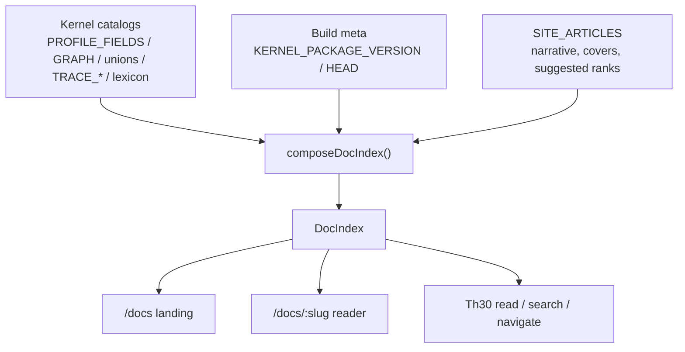

# Site docs spec

How `/docs` is built. What may go on a page is [DOCS_CONTRACT.md](DOCS_CONTRACT.md). Types live in [app/lib/docs/schema.ts](app/lib/docs/schema.ts). This file does not restate them.

The UI, the landing cards, the reader tree, and Th30 consume **one composed index**. Nothing in that index copies `FieldMeta.doc`, facet lists, stop kinds, or version strings. Those are imported from `@theoremjs/agents/schema` (and build-time kernel meta) at compose time.


```mermaid
flowchart TD
  kernel["Kernel catalogs\nPROFILE_FIELDS / GRAPH / unions / TRACE_* / lexicon"]
  meta["Build meta\nKERNEL_PACKAGE_VERSION / HEAD"]
  authored["SITE_ARTICLES\nnarrative, covers, suggested ranks"]
  compose["composeDocIndex()"]
  index["DocIndex"]
  landing["/docs landing"]
  reader["/docs/:slug reader"]
  th30["Th30 read / search / navigate"]

  kernel --> compose
  meta --> compose
  authored --> compose
  compose --> index
  index --> landing
  index --> reader
  index --> th30
```

## Ownership

- **Kernel** owns catalogs, omit resolvers, export names, and lexicon. Do not add an article CMS to `@theoremjs/agents`. Do not put site copy in the kernel.
- **Frontend** owns `DocArticle` / `AuthoredBlock` / `ResolvedBlock` / `PageSymbol`, authored guides, landing order, and covers.
- **Public surface** is the thirteen topic pages plus the published README truths the contract allows. Maintainer contracts stay on GitHub.

## Information hierarchy

Thirteen chapter URLs. The sidenav is chapters, then titled blocks on that page. Catalog rows are not headings and not their own routes.

The playground is `/playground`, not a docs chapter. CLI is deferred.

`PROFILE_TYPES` member sections (`#text` … `#host`) are required on modalities. Compose throws if any member id is missing.

```text
/docs                         landing: search + suggested cards
│
├── start                     Getting started
├── modalities                Choosing a modality
│     #text #image #speech #live #decision #host
├── identity                  Setting the identity
├── models                    Binding models
├── tools                     Registering tools
├── inputs                    Declaring inputs
├── outputs                   Declaring outputs
├── turn-behaviour            Setting turn behaviour
├── guardrails                Setting guardrails
├── traces                    Recording traces
├── statuses                  Describing statuses
├── runner                    Running a turn
└── interface                 Building the interface
```

Redirects live on `SITE_REDIRECTS` in [chapters.ts](app/lib/docs/articles/chapters.ts): `/docs/profiles` → modalities, `/docs/providers` → models, `/docs/observability` → traces, `/docs/host` → modalities#host, `/docs/cli` → start, `/docs/ui` → interface, `/docs/playground` → `/playground`.

Chapter order is `DOC_SECTIONS`. Do not author a second order.

## Article body

1. Still, tokens, actions
2. **This page covers** — `questions: { question: string }[]`
3. Narrative — `lede`, then titled `prose` / `callout` / `code` in question order. `prose.title` is the H2. Do not derive a label from `id`.
4. **Symbols** — filterable dictionary of the catalogs this topic owns
5. Previous / next, from `DOC_SECTIONS`. Start has no previous. Interface has no next.

Getting started carries the full program from `DOCS_SEEDS.firstTurn`. Topic pages show slices. Modalities may show a full `defineProfile` for one type. Snippet rules are in the contract.

## Dictionary

One catalog surface. Compose builds `article.symbols`. The reader renders that list. Do not also author a catalog block for the same rows.

| Catalog | Page | Placement |
| --- | --- | --- |
| Each `PROFILE_GRAPH` facet's fields | the topic `FACET_SECTION` names | [placement.ts](app/lib/docs/placement.ts) |
| Worthy unions (`PROFILE_TYPES`, `PROTOCOLS`, `PROVIDERS`, `TOOL_LOAD_TIERS`, `STREAM_MODES`) | the topic `UNION_SECTION` names | same file |
| `TRACE_SPAN_TYPES` and `TRACE_FIELDS` | traces | `traceCatalogRows()` |
| `LEXICON_KEYS` | statuses | `lexiconCatalogRows()` |

`EXTRA_FIELDS` (including `loadTier`) land on tools. Omit is `fieldMeta.unset` on the field row, labelled `(default)` in the hover card. Do not add a parallel resolver UI.

Playground excludes `host` and `decision`. Docs modalities includes them.

## Compose

`composeDocIndex()` runs from the Vite docs plugin (`ssrLoadModule` of [compose.ts](app/lib/docs/compose.ts)). Fallow cannot see that load, so `.fallowrc.jsonc` lists `compose.ts` as an entry.

Compose throws when:

- a `DOC_SECTIONS` chapter is missing, or a slug or suggest rank collides
- a summary is outside 110–160 characters, or equals the lede
- a cover is missing, not wide, or reused
- a chapter `entry` file is missing in the kernel checkout
- a facet is unplaced, or `FACET_SECTION` names a facet the graph does not have
- `fieldMeta` misses a path the dictionary asks for
- modalities is missing a `PROFILE_TYPES` member section
- kernel meta is the `1.0.0` / empty-HEAD fallback

`lastmod` is `git log -1 --format=%cI` over that article's source files. Omit it when git cannot answer. Never use mtime.

Search, Th30 `read`, and `/docs/:slug.md` use `projectArticleText`. JSON-LD `DefinedTerm`s come from `article.symbols`, not from a second field table.

Idle landing cards are `index.suggested`: start, modalities, runner, interface.

## What not to add back

- A generated `/docs/reference/…` article, or a `replaces` field that pretends to absorb one
- An authored `tree.order`. Order is `DOC_SECTIONS`
- A heading path on `FACET_SECTION` / `UNION_SECTION`. The dictionary is flat
- `catalog.fields`, `catalog.union`, `catalog.trace`, `catalog.lexicon`, or `facts` blocks. Those rows are symbols
- A hand-pasted `FieldMeta.doc` in prose
- `/api/live/relay` as a docs fact
- Snippet defaults the playground compiler would omit (`canary: true`, `allowContinue`, `inputs.text: true`)
