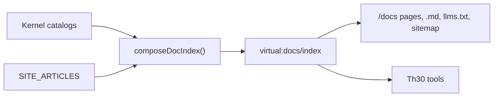

# Site docs spec

How `/docs` is built. What may go on a page is [DOCS_CONTRACT.md](DOCS_CONTRACT.md). Types live in [schema.ts](../app/lib/docs/schema.ts).

The landing page, the reader, the `.md` twins, `llms.txt`, the sitemap and Th30 all read **one composed index**. Nothing in it copies kernel copy (`FieldMeta.doc`, option descriptions, trace and lexicon text): compose imports it from `@theoremjs/agents` at build time, so a kernel change reaches every page on the next build.

```mermaid
flowchart LR
  kernel["Kernel catalogs"] --> compose["composeDocIndex()"]
  authored["SITE_ARTICLES"] --> compose
  compose --> index["virtual:docs/index"]
  index --> pages["/docs pages, .md, llms.txt, sitemap"]
  index --> th30["Th30 tools"]
```

## Where things live

| To change | Edit |
| --- | --- |
| A chapter's words, questions, code, cover | [articles/chapters.ts](../app/lib/docs/articles/chapters.ts) |
| Chapter order, or add a chapter | `DOC_SECTIONS` in [schema.ts](../app/lib/docs/schema.ts), then a matching entry in `SITE_ARTICLES` |
| Which chapter lists a facet's fields or a union's members | [placement.ts](../app/lib/docs/placement.ts) |
| Getting started's full program | the `firstTurn` draft in [seeds.ts](../app/lib/docs/seeds.ts) |
| A retired URL | `SITE_REDIRECTS` in chapters.ts |
| A cover's exposure | [still-match.ts](../app/lib/docs/still-match.ts) |

## A page

1. Cover, title, date, reading time
2. **This page covers**: the chapter's `questions`
3. Blocks in question order: `lede` paragraphs, titled `prose` (the H2s and the sidenav), `code`, `agent.paste`, `embed.playground`
4. The dictionary: catalog rows this chapter owns, from compose. An authored block with the same id replaces its row.
5. Previous and next, in `DOC_SECTIONS` order

## Compose

[compose.ts](../app/lib/docs/compose.ts) runs inside the Vite plugin ([docs-index-plugin.mjs](../scripts/docs-index-plugin.mjs)) and throws on drift; the error names the chapter and what to fix. `npm run lint:docs` runs it, then lints literal snippets with Biome and authored copy against [docs-banned-voice.json](../scripts/docs-banned-voice.json).

Every page's date is the later of the last commits to `app/lib/docs` and the kernel's `src` and README.

Fallow cannot see the plugin's `ssrLoadModule`, so `.fallowrc.jsonc` lists compose.ts as an entry.
